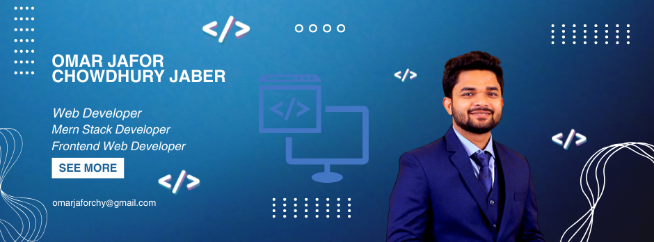

<h1 align="center">Hey there! I’m Omar Jafor Chowdhury 👋 </h1>
<h3 align="center">🚀 Frontend Developer | Backend Developer | MERN Stack | Competitive Programmer  🚀</h3>

 
  <h3> 👨🏻‍💻 Professional Introduction </h3>

  - 🤔 &nbsp; Exploring new technologies and developing software solutions and quick hacks.
  - 🎓 &nbsp; Graduated in Computer Science and Engineering.
  - 💼 &nbsp; I’m currently working on Full Stack Development projects.
  - 🌱 &nbsp; Learning more about Backend Architectures and Frontend Developement.
  - ✍️ &nbsp; Pursuing Competitive Programming and Gaming, Movies as hobbies/side hustles.
  - 💞️ &nbsp; I am seeking an opportunity to join a web development team where I can contribute my skills and collaborate effectively.
  - 📫 &nbsp; My objective is to progress within the field and attain the position of a senior web developer within a two-year timeframe.

 

## 💻 Profile Highlights

 

  

## 💻 Let's Connect

 

 

## 💻 Tech Capabilities
#### Experienced MERN Stack Frontend Developer proficient in HTML, CSS, Tailwind, JavaScript, React, Node.js, Express.js, MongoDB, and Firebase. Crafting dynamic web applications with engaging interfaces and robust backend systems. Committed to delivering innovative solutions that elevate user experiences and drive business growth.

## 💻 Technical Proficiencies

 

 

 

## 📚 Profile Summary

 

  

  
  

 

## 📚 Latest Projects

### Assets Strive Website
#### [ Live Link](https://asset-strive-omarjafor.web.app/)

- ✍️ Separate functionalities for allowing employees to manage assets and enabling admins to oversee all employees.

- ✍️ Implemented JWT-based authentication for users logins.

- ✍️ For employee and admin pages, allowing only verified individuals to access specific functionalities.

### Curious Canvas Website
#### [ Live Link](https://curious-canvas.web.app/)
- ✍️ Enabled detailed blog post viewing, editing, and updating functionalities for registered users.

- ✍️ Facilitated blog comments by users, encouraging interaction and community engagement, while ensuring user-specific limitations.

- ✍️ Implemented user-friendly features like a dark/light theme toggle, engaging visuals.

### Bombshell Beauty Website
#### [ Live Link](https://bombshell-beauty-omarjafor.web.app/)
- ✍️ Created an engaging brand shop platform enabling user registration, login, and personalized profiles.
- ✍️ Designed a dynamic homepage showcasing top brands, featured products, and special offers to enhance user experience.
- ✍️ Implemented shopping cart functionality, allowing users to add, view, and manage their selected items conveniently.
